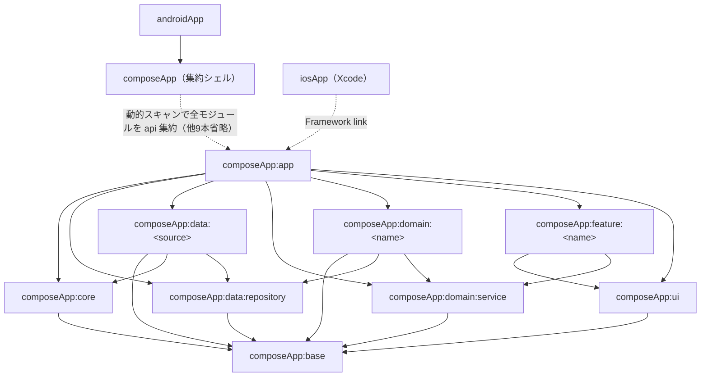

# アーキテクチャ概要

> 対象: レイヤー構成、モジュール地図、依存許可、契約/実装モジュール分離、縦断データフローの全体設計
> 関連: [module-guide.md](module-guide.md), [dependency-injection.md](dependency-injection.md), [navigation.md](navigation.md), [error-handling.md](error-handling.md), [../guides/data-layer.md](../guides/data-layer.md), [../guides/domain-layer.md](../guides/domain-layer.md), [../guides/ui-layer.md](../guides/ui-layer.md), [../decisions/0001-contract-and-impl-modules.md](../decisions/0001-contract-and-impl-modules.md), [../decisions/0002-repository-interface-in-data-layer.md](../decisions/0002-repository-interface-in-data-layer.md), [../decisions/0009-module-granularity.md](../decisions/0009-module-granularity.md), [../decisions/0010-feature-depends-on-service-only.md](../decisions/0010-feature-depends-on-service-only.md)
> 最終確認コミット: ac56102

## 要点

- レイヤーは `base`（共有カーネル）→ `core`/`ui`/契約モジュール（`data:repository`, `domain:service`）→ 実装モジュール（`data:<source>`, `domain:<name>`）→ `feature:<name>` → `app` → `androidApp`/`iosApp` の順に積み上がる。
- **実装モジュール同士の直接依存は必須で禁止**。`domain:<name>` は `data:<source>` に依存せず、`data:repository`（interface のみ）を介する。
- Repository interface は `data:repository`（**data 層**）に置く。domain 側が Repository interface を所有する古典的 DIP は採用していない。
- `feature:<name>` は `ui` と `domain:service` にのみ依存し、`data` 層・実装モジュールには一切触れない。Gradle の依存宣言レベルで物理的に強制される。
- `composeApp`（集約シェル）は `projectDir.walk().maxDepth(3)` で配下の `build.gradle.kts` を動的検出し、全サブモジュールへ `api` 依存する。新規モジュールを増やしても `composeApp/build.gradle.kts` 自体の編集は不要（詳細は [module-guide.md](module-guide.md)）。
- 依存境界を強制する CI/lint（ArchUnit 等）は存在しない。逸脱の検出は PR レビュー時に本書の依存許可表と照合して行う。
- ユーザー操作は `EventHandler` → `ViewModel` → `Service`（Result 化）→ `Repository`（例外透過）→ Ktorfit API → `Converter` → domain モデル → `UiState` → 描画、という一方向のデータフローを取る。

## ルール

- **ARCH-1（必須）**: 実装モジュール同士（例: `data:<source>` と `domain:<name>`、`feature:<a>` と `feature:<b>`）を直接依存させない。層を跨ぐ参照は必ず契約モジュール（`data:repository` / `domain:service`）または `ui` を経由する。
- **ARCH-2（必須）**: Repository interface は `data:repository` に定義する。`domain:<name>`（実装）はこの interface に `implementation` 依存してよいが、`data:<source>`（実装）に依存してはならない。
- **ARCH-3（必須）**: `feature:<name>` は `ui` と `domain:service` にのみ依存する。`data` 層・`domain:<name>`（実装）への依存を追加しない。
- **ARCH-4（必須）**: `base` は全モジュールが依存してよい唯一の共有カーネル。UI を持たず、domain モデル・共通エラー型・拡張関数のみを置く。
- **ARCH-5（推奨）**: `base` に置くのは 2 箇所以上のモジュールから参照される共通要素のみ。1 モジュールでしか使わない型・関数はそのモジュールのローカルパッケージに置く（新規決定）。
- **ARCH-6（必須）**: モジュール間の依存境界は Gradle の `implementation`/`api` 宣言のみで表現される。自動検査ツールは無いため、依存追加・変更を含む PR は本書の依存許可表と突き合わせてレビューする。
- **ARCH-7（必須）**: `app` と `composeApp`（集約シェル）は例外的に全実装モジュールへ依存してよい。新規実装モジュールを追加したとき、他モジュールから利用させたい場合は `composeApp/app/build.gradle.kts` の依存にのみ追記する（`composeApp` シェル自体は動的スキャンのため編集不要）。
- **ARCH-8（必須）**: モジュール階層の深さはレイヤーによって非対称。`base`/`core`/`ui`/`app` は `composeApp/<name>` の1階層、`data`/`domain`/`feature` は `composeApp/<layer>/<name>` の2階層とする。
- **ARCH-9（必須）**: Gradle パスのコロン区切り（`:composeApp:data:zenn`）とディレクトリのスラッシュ区切り（`composeApp/data/zenn/`）は常に機械的に対応させる。別名・エイリアス・`project(":customPath")` のような特殊指定はしない。
- **ARCH-10（必須）**: 契約モジュール（`data:repository`, `domain:service`）内の各 interface は、空のマーカー interface（`Repository` / `Service`）を継承する。
- **ARCH-11（必須）**: 実装クラスは `<Interface>Impl` と命名し、契約モジュールとは別モジュールに置く（同一モジュール内に interface と実装を同居させない）。

## 判断基準

### 依存許可表

| 依存元 | 依存してよい先 |
|---|---|
| `base` | なし（全モジュールが依存してよい最下層。他モジュールへの依存を持たない） |
| `core` | `base` |
| `data:repository` | `base` |
| `domain:service` | `base` |
| `ui` | `base` |
| `data:<source>`（実装） | `core`, `data:repository` |
| `domain:<name>`（実装） | `data:repository`, `domain:service` |
| `feature:<name>` | `ui`, `domain:service` |
| `app` | 全モジュール（実装モジュールを含む） |
| `composeApp`（集約シェル） | 全モジュール（動的スキャン。詳細は [module-guide.md](module-guide.md)） |
| `androidApp` | `composeApp`（集約シェル） |
| `iosApp`（Xcode プロジェクト。Gradle モジュールではない） | `composeApp:app` が生成する `ComposeApp.framework` をリンク |

**実装モジュール同士（`data:<source>` ↔ `domain:<name>`、`feature:<a>` ↔ `feature:<b>` 等）の直接依存は必須で禁止**。新しい依存が必要になった場合は、契約モジュール側に interface を追加するか、`base` に共通要素を切り出すかを検討する。

### 個別の判断

- 新しいモジュールがどの層に依存してよいか迷う場合 → 上表をそのまま適用する。表にない依存（例: `feature` から `data:<source>` へ）は理由の如何を問わず追加しない。
- 新しい共通コード（拡張関数・共通データモデル）をどこに置くか迷う場合 → プラットフォーム/UI 非依存かつ 2 箇所以上から参照されるなら `base`、UI コンポーネントなら `ui` の `shared/component/<domain>/` または `design/system/`（判定基準は [../guides/ui-layer.md](../guides/ui-layer.md) に委ねる）、1 モジュールでしか使わないなら昇格させずローカルに置く。（A-7-3）
- Repository/Service の interface をどのモジュールに置くべきか迷う場合 → 常に `data:repository`（Repository）/ `domain:service`（Service）に置く。`domain` 側が Repository interface を所有する古典的なクリーンアーキテクチャの依存関係逆転（DIP）は**採用しない**。理由は次節。（C-9-5）
- 依存境界の違反（例: `feature` が `data:<source>` に `implementation` 依存を追加するコミット）を見つけた場合 → 自動検査は存在しないため、PR レビューで本書の依存許可表と照合し、逸脱していれば差し戻す。（A-7-10）

## 実装パターン

契約モジュール（interface）と実装モジュール（impl）の組を新設するときの最小スケルトン（プレースホルダ）。

```kotlin
// composeApp/data/repository/src/commonMain/kotlin/org/starter/project/data/repository/XxxRepository.kt（契約: data:repository）
package org.starter.project.data.repository

interface XxxRepository : Repository {
    suspend fun fetchXxx(id: String): XxxModel
}
```

```kotlin
// composeApp/data/<source>/src/commonMain/kotlin/org/starter/project/data/<source>/repository/XxxRepositoryImpl.kt（実装: data:<source>）
package org.starter.project.data.<source>.repository

class XxxRepositoryImpl(
    private val xxxApi: XxxApi
) : XxxRepository {
    override suspend fun fetchXxx(id: String): XxxModel {
        return XxxConverter(xxxApi.fetchXxx(id))
    }
}
```

```kotlin
// composeApp/domain/service/src/commonMain/kotlin/org/starter/project/domain/service/XxxService.kt（契約: domain:service）
package org.starter.project.domain.service

interface XxxService : Service {
    suspend fun fetchXxx(id: String): Result<XxxModel>
}
```

```kotlin
// composeApp/domain/<name>/src/commonMain/kotlin/org/starter/project/domain/<name>/XxxServiceImpl.kt（実装: domain:<name>）
package org.starter.project.domain.<name>

class XxxServiceImpl(
    private val resultHandler: ResultHandler,
    private val xxxRepository: XxxRepository
) : XxxService {
    override suspend fun fetchXxx(id: String) = resultHandler.async {
        xxxRepository.fetchXxx(id)
    }
}
```

この4ファイルが「契約モジュール/実装モジュール分離パターン」（次節）の最小実例であり、ARCH-2・ARCH-10・ARCH-11 を満たす形になっている。

## 契約モジュール/実装モジュール分離パターン

`data:repository`・`domain:service` は **interface のみを持つ「契約モジュール」**であり、`data:<source>`・`domain:<name>` が対応する**「実装モジュール」**になる。

```text
composeApp/data/repository   … Repository interface（契約）
composeApp/data/<source>     … XxxRepositoryImpl（実装。core, data:repository に依存）
composeApp/domain/service    … Service interface + ResultHandler（契約）
composeApp/domain/<name>     … XxxServiceImpl（実装。data:repository, domain:service に依存）
```

この分離により、`feature:<name>` は契約モジュール（`domain:service`）だけを見ればよく、Gradle の依存宣言だけで「feature は実装の詳細を知らない」という境界を強制できる（[../decisions/0001-contract-and-impl-modules.md](../decisions/0001-contract-and-impl-modules.md)）。

### Repository interface が data 層にある理由（古典的 DIP を採用しない）

教科書的なクリーンアーキテクチャでは「domain 層が Repository interface を所有し、data 層がそれを implements することで依存関係を逆転させる」パターンが定石とされる。しかし本テンプレートは **Repository interface を data 層（`data:repository`）に置き、domain 側（`domain:<name>`）がそれに `implementation` 依存する**という、素直な一方向依存を採用している（[../decisions/0002-repository-interface-in-data-layer.md](../decisions/0002-repository-interface-in-data-layer.md)）。

- `domain:service`（Service の契約）は `base` にしか依存せず、data 層の存在を一切知らない。
- `domain:<name>`（Service の実装）だけが `data:repository` の interface に依存する。
- 結果として **feature から見た依存境界**（`domain:service` だけを見ればよい）は実現されているが、「domain が抽象を介して data を所有する」という古典的 DIP は成立していない。

**AI エージェントへの注意**: 一般的な設計知識から「Repository interface は domain 層に置くべきでは」と判断し、`data:repository` の interface を `domain:service` 配下へ移すリファクタを提案しないこと。この配置は本テンプレートの確立した規約であり、変更は大規模なモジュール再編を伴う。

## モジュール地図



**図から省略した依存**: `composeApp`（集約シェル）は `projectDir.walk().maxDepth(3)` で配下の全モジュール（`app`, `base`, `core`, `data:repository`, `data:<source>`, `domain:service`, `domain:<name>`, `feature:<name>`, `ui` の全部）を `api` 依存として束ねる。この 9〜10 本の `composeApp → 各モジュール` の矢印は図が読めなくなるため代表 1 本のみ残して省略した。詳細な仕組みと制約（`maxDepth=3`）は [module-guide.md](module-guide.md) を参照。

`androidApp` は Gradle モジュールとして `composeApp`（集約シェル）に `implementation` 依存し、その `api` 集約を通じて全モジュールへ到達する。`iosApp` は Xcode プロジェクトであり Gradle モジュールではないため、Gradle 依存グラフには含まれない。`composeApp:app` が生成する `ComposeApp.framework`（静的リンク）を Xcode の Run Script でリンクする形で連携する。

## 縦断データフロー

ユーザー操作から画面描画までは、次の一方向フローを取る（[../guides/data-layer.md](../guides/data-layer.md)・[../guides/domain-layer.md](../guides/domain-layer.md)・[../guides/ui-layer.md](../guides/ui-layer.md) にレイヤーごとの詳細がある）。

1. **UI 操作**: Composable のコールバック（例: `onValueChange`）が `dispatch(XxxScreenEvent.OnXxx(...))` を呼ぶ。
2. **イベント処理**: `XxxScreenEventHandler.invoke` が `event` を `when` で分岐し、`viewModel.doXxx(...)` を呼ぶ（画面遷移なら `appRouter.navigate(...)` を直接呼ぶ）。
3. **ViewModel 状態更新 / Service 呼び出し**: ViewModel が `_state.update { it.copy(...) }` で即時更新するか、`xxxService.fetchXxx(...).handle(ErrorScreenThrowableHandler(_screenState))` のように `domain:service` の interface を呼ぶ。
4. **Service（Result 化）**: `domain:<name>` の実装が `resultHandler.async { }` / `resultHandler.immediate { }` で Repository 呼び出しを `Result<T>` に変換する。ここが例外 → `Result` 変換の唯一の境界。
5. **Repository（例外透過）**: `data:<source>` の実装が Ktorfit の `XxxApi` を呼び出す。例外は握りつぶさずそのまま伝播させる。
6. **Ktorfit API / HttpClient**: `core` の `ApiClientImpl` が保持する Ktor `HttpClient` を通じて HTTP リクエストを送信する。
7. **Converter**: レスポンス DTO を `XxxConverter`（`object` + `operator fun invoke`）が `validateNotNull` で検証しつつ domain モデル（`base`）へ変換する。
8. **UiState への反映**: 変換された domain モデルが ViewModel の `state`（`UiState`）に載る。
9. **描画**: Composable が `collectAsState()` / `collectAsStateWithLifecycle()`（推奨）で `state` を収集し再描画する。

## サンプルコードが暗黙に確立している規約（構造系。サンプルでの根拠）

以下はサンプル実装（Zenn ビューワー。削除後は存在しない）が確立しているが、テンプレート利用時にサンプルが削除されると根拠が失われる構造上の規約。ルール ARCH-8〜ARCH-11 として上記に採録済みだが、背景を補足する。

- モジュール階層の深さの非対称性（ARCH-8）: `:composeApp:base` は1階層、`:composeApp:data:zenn` は2階層。新規ドメイン追加時に `composeApp/payment/`（1階層）にすべきか `composeApp/data/payment/` + `composeApp/domain/payment/`（2階層）にすべきかは、このレイヤー種別（共有基盤か外部リソース実装か）で判断する（`payment` はいずれも例。実在しない）。
- Gradle パスとディレクトリパスの機械的対応（ARCH-9）: `include(":composeApp:data:zenn")` と物理ディレクトリ `composeApp/data/zenn/` は常に一致する。
- マーカー interface パターン（ARCH-10）: `interface Repository`・`interface Service` はいずれも中身のない継承専用 interface（3行程度）。型的なグルーピングと将来の共通処理追加余地のために存在する。
- 実装クラスの `Impl` サフィックスと別モジュール配置（ARCH-11）: `ZennRepositoryImpl`、`ZennServiceImpl` のように必ず `Impl` を付け、契約モジュールとは異なるモジュールに置く。

## アンチパターン

- **`feature:<name>` に `data:<source>` への `implementation` 依存を追加する** → NG。`feature` は Gradle レベルで `data` 層に触れない設計。ViewModel から直接 API/DB を叩きたい場合でも `domain:service` の Service を経由する。
- **`domain:<name>` が `data:<source>`（実装）に直接依存する** → NG。実装モジュール同士の直接依存は禁止（ARCH-1）。`data:repository` の interface 経由にする。
- **Repository interface を `domain:service` 配下に移動するリファクタ** → NG。本テンプレートは古典的 DIP を採用していない（本書「Repository interface が data 層にある理由」参照）。一般的な設計原則を根拠に移動しない。
- **新しいモジュールを `composeApp/<name>` のような1階層に置く（`data`/`domain`/`feature` なのに）** → NG。ARCH-8 の非対称ルールに反する。`composeApp/<layer>/<name>` の2階層にする。
- **依存境界の逸脱を「テストが通るから」という理由で許容する** → NG。CI/lint による自動検査が無い（ARCH-6）ため、テストの成否は依存境界の妥当性を保証しない。PR レビューで依存許可表と照合する。

## 参考実装（サンプル。削除後は存在しない）

- `composeApp/data/repository/src/commonMain/kotlin/org/starter/project/data/repository/Repository.kt` — マーカー interface の実例。
- `composeApp/data/repository/src/commonMain/kotlin/org/starter/project/data/repository/ZennRepository.kt` — Repository interface（data 層）の実例。
- `composeApp/domain/service/src/commonMain/kotlin/org/starter/project/domain/service/Service.kt` — マーカー interface の実例。
- `composeApp/domain/service/src/commonMain/kotlin/org/starter/project/domain/service/ZennService.kt` — Service interface の実例。
- `composeApp/domain/zenn/src/commonMain/kotlin/org/starter/project/domain/zenn/ZennServiceImpl.kt` — Service 実装（`data:repository` interface に依存）の実例。
- `composeApp/data/zenn/src/commonMain/kotlin/org/starter/project/data/zenn/repository/ZennRepositoryImpl.kt` — Repository 実装の実例。
- `composeApp/build.gradle.kts` — 集約シェルの動的スキャン実装全文。
- `composeApp/feature/home/src/commonMain/kotlin/org/starter/project/feature/home/HomeScreenViewModel.kt` — 縦断データフローのうち ViewModel → Service 呼び出しの実例。

## チェックリスト

- [ ] 追加・変更した `implementation`/`api` 依存が本書の依存許可表に反しないか確認した。
- [ ] 実装モジュール同士を直接依存させていないか確認した。
- [ ] Repository/Service の新規 interface を契約モジュール（`data:repository`/`domain:service`）に置き、マーカー interface を継承させた。
- [ ] 実装クラスを `<Interface>Impl` と命名し、契約モジュールとは別モジュールに置いた。
- [ ] `base` に追加した要素が「2箇所以上から参照される」条件を満たしている。
- [ ] 新規モジュールが `composeApp/<layer>/<name>`（2階層）または `composeApp/<name>`（1階層）のいずれか正しい階層に置かれている。
